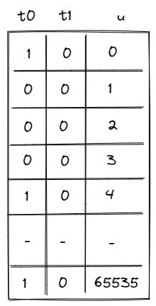
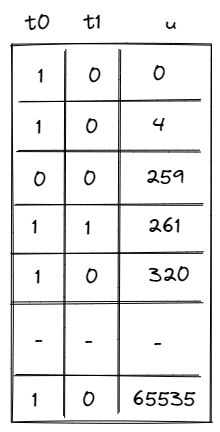
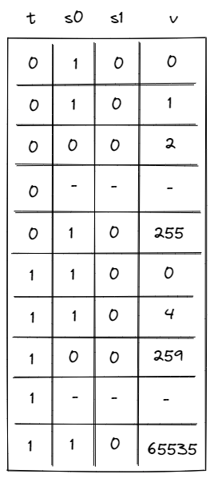

Miden VM relies very heavily on 16-bit range-checks (checking if a value of a field element is between $0$ and $2^{16}$). For example, most of the [u32 operations](./stack/u32_ops.md) need to perform between two and four 16-bit range-checks per operation. Similarly, operations involving memory (e.g. load and store) require two 16-bit range-check per operation.

Thus, it is very important for the VM to be able to perform a large number 16-bit range checks very efficiently. In this article, we describe how this can be achieved using permutation checks.

## 8-bit range checks

First, let's define a construction for the simplest possible 8-bit range-check. This can be done with a single column as illustrated below.

For this to work as a range-check we need to enforce a few constraints on this column:

- Value in the first row must be $0$.
- Value in the last row must be $255$.
- As we move from one row to the next, we can either keep the value the same, or increment it by $1$.

Denoting $v$ as the value of column $v$ in the current row, and $v'$ as the value of column $v$ in the next row, we can enforce the last condition as follows:

$$
(v' - v) \cdot (v' - v - 1) = 0
$$

Together, these constraints guarantee that all values in column $v$ are between $0$ and $255$ (inclusive).

We can then add another column $p_0$, which will keep a running product of values in $v$ offset by random value $\alpha$ (provided by the verifier). Transition constraints for column $p_0$ would look like so:

$$
p'_0 - p_0 \cdot (\alpha + v) = 0
$$

Using these two columns we can check if some other column in the execution trace is a permutation of values in $v$. Let's call this other column $x$. We can compute the running product of $x$ in the same way as we compute the running product for $v$. Then, we can check that the last value in $p_0$ is the same as the final value for the running product of $x$ (this is the permutation check).

While this approach works, it has a couple of limitations:

- First, column $v$ must contain all values between $0$ and $255$. Thus, if column $x$ does not contain one of these values, we need to artificially add this value to $x$ somehow (i.e., we need to pad $x$ with extra values).
- Second, assuming $n$ is the length of execution trace, we can range-check at most $n$ values. Thus, if we wanted to range-check more than $n$ values, we'd need to introduce another column similar to $v$.

To get rid of the padding requirement, we can add a _selector_ column, which would contain $1$ for values we want to include in the running product, and $0$ for the ones we don't. But we can address both issues with a single solution.

### A better construction

Let's add two selector column to our table $s_0$ and $s_1$ as illustrated below.

The purpose of these columns is as follows:

- When $s_0 = 0$ and $s_1 = 0$, we won't include the value into the running product.
- When $s_0 = 1$ and $s_1 = 0$, we will include the value into the running product.
- When $s_0 = 0$ and $s_1 = 1$, we will include two copies of the value into the running product.
- When $s_0 = 1$ and $s_1 = 1$, we will include four copies of the value into the running product.

Thus, for the table pictured below, the running product will include: a single $0$, a single $1$, no $2$'s, and five $3$'s etc.

To keep the description of constraints simple, we'll first define the four flag values as follows:

$$
f_0 = (1 - s_0) \cdot (1 - s_1)
$$

$$
f_1 = s_0 \cdot (1 - s_1)
$$

$$
f_2 = (1 - s_0) \cdot s_1
$$

$$
f_3 = s_0 \cdot s_1
$$

Thus, for example, when $s_0 = 1$ and $s_1 = 1$, $f_3 = 1$ and $f_0 = f_1 = f_2 = 0$.

Then, we'll update transition constraints for $p_0$ like so:

$$
p'_0 - p_0 \cdot \left((\alpha + v)^4 \cdot f_3 + (\alpha + v)^2 \cdot f_2 + (\alpha + v) \cdot f_1 + f_0\right) = 0
$$

The above ensures that when $f_0 = 1$, $p_0$ remains the same, when $f_1 = 1$, $p_0$ is multiplied by $(\alpha + v)$, when $f_2 = 1$, $p_0$ is multiplied by $(\alpha + v)^2$, and when $f_3 = 1$, $p_0$ is multiplied by $(\alpha + v)^4$.

We also need to ensure that values in columns $s_0$ and $s_1$ are binary (either $0$ or $1$). This can be done with the following constraints:

$$
s_0^2 - s_0 = 0
$$

$$
s_1^2 - s_1 = 0
$$

And lastly, for completeness, we still need to impose a transition constraint that we had in the naive approach:

$$
(v' - v) \cdot (v' - v - 1) = 0
$$

This 3-column table addresses the limitations we had as follows:

1. We no longer need to pad the column we want to range-check with extra values because we can skip the values we don't care about.
2. We can support almost $4n$ range checks (when $n$ is relatively large). Though, for short traces (when $n < 256$), we can range-check at most $n$ unique values.

The one downside of this approach is that the degree of our constraints is now $6$ (vs. $2$ in the naive approach). But in the context of Miden VM this doesn't matter as maximum constraint degree for the VM is $8$ anyway.

## 16-bit range checks

To support 16-bit range checks, let's try to extend the idea of the 8-bit table. Our 16-bit table would look like so (the only difference is that column $u$ now has to end with value $65535$):

While this works, it is rather wasteful. In the worst case, we'd need to enumerate over 65K values, most of which we may not actually need. It would be nice if we could "skip over" the values that we don't want. We can do this by relying on 8-bit range checks. Specifically, instead of enforcing constraint:

$$
(u' - u) \cdot (u' - u - 1) = 0
$$

We would enforce:

$$
p'_1 - p_1 \cdot (\alpha + u' - u) = 0
$$

Where $p_1$ is another running product column. At the end of the execution trace, we would check that $p_0 = p_1$. This would ensure that as we move from one row to another, values in column $u$ increase by at most $255$ (we are basically performing an 8-bit range check on increments of column $u$). Now, our table can look like this:

We still may need to include some unneeded rows because we can not "jump" by more than $255$ values, but at least we are guaranteed that the number of such unneeded rows will never be greater than $256$.

We also need to add another running product column $p_2$ to support permutation checks against column $u$. The constraint that we'll need to impose against this column is identical to the constraint we imposed against column $p_0$ and will look like so:

$$
p'_2 - p_2 \cdot \left((\alpha + u)^4 \cdot f_3 + (\alpha + u)^2 \cdot f_2 + (\alpha + u) \cdot f_1 + f_0\right) = 0
$$

Overall, with this construction we have the following:

- We need two table of three columns each ($6$ columns total), and we need $3$ running product columns.
- This gives us the ability to do the following:
  - For long traces (when $n > 2^{16}$) we can support almost $4n$ arbitrary 16-bit range-checks.
  - For short traces, we can range-check at most $n$ unique values, but if there are duplicates, we can support up to $4n$ total range-checks.

But we can do better.

## Optimizations

First, we can just stack the tables on top of each other. We'll need to add a column to partition the table between the sections used for 8-bit range checks and sections used for 16-bit range checks. Let's call this column $t$. When $t = 0$, we'll apply constraints for the 8-bit table, and when $t = 1$, we'll apply constraints for the 16-bit table.

Second, we can merge running product columns $p_0$ and $p_1$ into a single column. We'll do it like so:

- When $t = 0$, we'll multiply the current value of the column by the 8-bit value (offset by random $\alpha$) that we want to add into the running product.
- When $t = 1$, we'll divide the current value of the column by the 8-bit value (offset by random $\alpha$) which we'd like to remove from the running product.

In the end, if we added and then removed all the same values, the value in this column (let's call it $p_0$) should equal to $1$, and we can check this condition via a boundary constraint.

### Optimized constraints

Below we list the full set of constraints needed to support the optimized construction described above.

First, we'll need to make sure that all selector flags are binary. This can be done with the following constraints:

$$
t^2 - t = 0
$$

$$
s_0^2 - s_0 = 0
$$

$$
s_1^2 - s_1 = 0
$$

Next, we need to make sure that values in column $t$ can "flip" from $0$ to $1$ only once. The following constraint enforces this:

$$
t \cdot (1 - t') = 0
$$

Next, we need to make sure that when column $t$ "flips" from $0$ to $1$ (we are moving from the 8-bit section of the table to the 16-bit section), the current value in column $v$ is equal to $255$, and the next value is reset to $0$. This can be done with the following constraints:

$$
(1 - t) \cdot t' \cdot (v - 255) = 0
$$

$$
(1 - t) \cdot t' \cdot v' = 0
$$

Next, we need to enforce that running products for the 8-bit section of the table and for the 16-bit sections of the table are computed correctly. To simplify the notation, we'll first define variable $z$ as:

$$
z = (\alpha + v)^4 \cdot f_3 + (\alpha + v)^2 \cdot f_2 + (\alpha + v) \cdot f_1 + f_0
$$

We'll compute the 16-bit running product in column $p_1$. Transition constraints for this column are fairly straightforward:

$$
p'_1 = p_1 \cdot (z \cdot t - t + 1)
$$

Thus, when $t = 0$, value in $p_1$ does not change, but when $t = 1$, the next value in $p_1$ is computed by multiplying the current value by $z$.

For the 8-bit running product we'll use column $p_0$. Constraints against this column are a bit more complicated. The complication stems from the fact that for the 8-bit section of the table, we want to build up the product, but for the 16-bit section of the table, we want to reduce it. The constraints look as follows:

$$
p'_0 \cdot ((\alpha + v' - v) \cdot t - t + 1) = p_0 \cdot (z - z \cdot t + t)
$$

Thus, when $t = 0$ (we are in the 8-bit section), the above expression reduces to:

$$
p'_0 = p_0 \cdot z
$$

But when $t = 1$ (we are in the 16-bit section), we get the following:

$$
p'_0 \cdot (\alpha + v' - v) = p_0
$$

The above actually enforces that $p'_0 = p_0 / (\alpha + v' - v)$. Thus, if the prover arranged the 8-bit and the 16-bit sections of the table correctly, we should end up with $p_0 = 1$ at the end of the trace.

In addition to the transition constraints described above, we also need to enforce the following boundary constraints:

- Value of $v$ in the first row is $0$.
- Value of $v$ in the last row is $65535$.
- Value of $p_0$ in the first and last rows is $1$.

Overall, with this optimized construction we have the following:

- We need a single table with $4$ columns, and we need $2$ running product columns.
- The construction gives us the following capabilities:
  - For long traces (when $n > 2^{16}$), we can do over $3n$ arbitrary 16-bit range-checks.
  - For short traces ($2^{10} < n \le 2^{16}$), we can range-check at slightly fewer than $n$ unique values, but if there are duplicates, we may be able to range-check up to $3n$ total values.

The only downside of this construction is again higher constraint degree. Specifically, some of the transition constraints described above have degree $8$. But again, in the context of Miden VM, this doesn't matter as max constraint degree of the VM is $8$ anyway.
