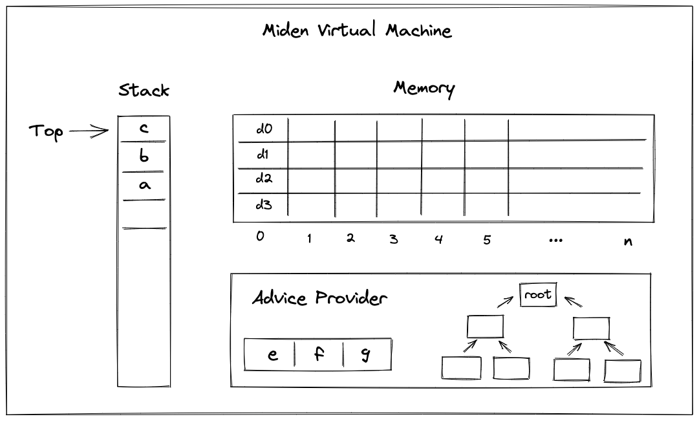

## Miden VM overview
Miden VM is a stack machine. The base data type of the MV is a field element in a 64-bit [prime field](https://en.wikipedia.org/wiki/Finite_field) defined by modulus $p = 2^{64} - 2^{32} + 1$. This means that all values that the VM operates with are field elements in this field (i.e., values between $0$ and $2^{64} - 2^{32}$, both inclusive).

Throughout this document, we use lower-case letters to refer to individual field elements (e.g., $a$). Sometimes it is convenient to describe operations over groups of elements. For these purposes we define a *word* to be a group of four elements. We use upper-case letters to refer to words (e.g., $A$). To refer to individual elements within a word, we use numerical subscripts. For example, $a_0$ is the first element of word $A$, $b_3$ is the last element of word $B$, etc.

Miden VM consists of three high-level components as illustrated below.

These components are:
* **Stack** which is a push-down stack where each item is a field element. Most assembly instructions operate with values located on the stack. The stack can grow up to $2^{16}$ items deep, however, only the top 16 items are directly accessible.
* **Memory** which is a linear random-access read-write memory. The memory is word-addressable, meaning, four elements are located at each address, and we can read and write elements to/from memory in batches of four. Memory addresses can be in the range $[0, 2^{32})$.
* **Advice provider** which is a way for the prover to provide non-deterministic inputs to the VM. The advice provider contains a single *advice tape* and unlimited number of *advice sets*. The latter contain structured data which can be interpreted as a set of Merkle paths.

In the future, additional components (e.g., storage, logs) may be added to the VM.

### Terms and notations
In this note we use the following terms and notations:

- $p$ is the modulus of the VM's base field which is equal to $2^{64} - 2^{32} + 1$.
- A *binary* value means a field element which is either $0$ or $1$.
- Inequality comparisons are assumed to be performed on integer representations of field elements in the range $[0, p)$.
